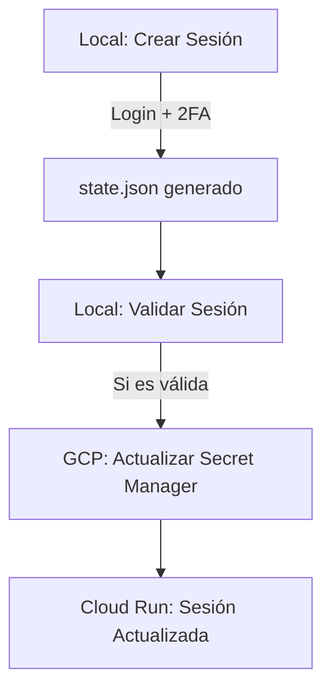

# 🔐 Guía: Actualización de Cookies en GCP (MyCase Scraper)

Esta guía detalla el proceso para renovar la sesión de MyCase y actualizarla en la infraestructura de Google Cloud Platform (GCP) para que el scraper siga funcionando en **Cloud Run** sin interrupciones.

---

## 🏗️ Flujo de Trabajo
La sesión de MyCase expira periódicamente o cuando se cierra sesión manualmente. Dado que MyCase requiere **Autenticación de Dos Factores (2FA)**, la renovación debe hacerse localmente antes de subirla a la nube.



---

## 🛠️ Paso 1: Generar la Sesión Localmente
Debes ejecutar este paso en una máquina con entorno gráfico (tu laptop/workspace local) ya que se abrirá un navegador visible para el login.

1.  **Ejecutar el script de creación de sesión:**
    ```bash
    python3 scripts/crear_sesion.py
    ```
2.  **Login Manual:** Se abrirá una ventana de Chromium. Ingresa tu correo, contraseña y el código **2FA**.
3.  **Finalizar:** Una vez que veas el Dashboard de MyCase, regresa a la terminal y presiona `ENTER`.
    *   Esto generará el archivo `state.json` en la raíz del proyecto.

---

## 🧪 Paso 2: Validar la Sesión
Antes de subir nada a la nube, asegúrate de que el archivo generado realmente funciona.

```bash
python3 scripts/validar_sesion.py
```
*   **Si el resultado es `sesión ACTIVA`**, procede al siguiente paso.
*   **Si falla**, repite el Paso 1.

---

## ⬆️ Paso 3: Actualizar Google Secret Manager
Este script automatiza la codificación de la sesión en Base64 y la sube a **Google Secret Manager**.

1.  **Asegúrate de estar autenticado en gcloud:**
    ```bash
    gcloud auth login
    ```
2.  **Ejecutar el script de actualización:**
    ```bash
    python3 scripts/actualizar_secreto_sesion.py
    ```

### 🔒 Secretos involucrados en GCP
El script actualizará o creará el siguiente secreto:

| Secreto Manager ID | Variable de Entorno vinculada | Descripción |
| :--- | :--- | :--- |
| `mycase_session_state` | `PW_STATE_B64` | Estado de Playwright (cookies + localStorage) en Base64. |

---

## 🚀 Paso 4: Notificar a Cloud Run
Una vez que el secreto tiene una nueva versión, **Cloud Run** debería tomarla automáticamente si está configurado para apuntar a `:latest`. Si no es así, el script anterior te imprimirá el comando exacto para actualizar el servicio. El comando suele verse así:

```bash
gcloud run services update mycase-scraper \
  --update-secrets=PW_STATE_B64=mycase_session_state:latest \
  --region us-central1
```

---

## 💡 Tips de Mantenimiento
> [!TIP]
> **No compartas el state.json**: Este archivo contiene tus credenciales activas. Nunca lo subas a GitHub. El `.gitignore` ya debería estar configurado para ignorarlo.

> [!IMPORTANT]
> **Frecuencia**: Se recomienda renovar la sesión cada 30 días o si detectas errores de autenticación (401/403) en los logs de Cloud Run.

---

## 📋 Resumen de Scripts
| Script | Propósito |
| :--- | :--- |
| `crear_sesion.py` | Abre navegador para login manual y guarda `state.json`. |
| `validar_sesion.py` | Prueba el `state.json` local para ver si MyCase lo acepta. |
| `actualizar_secreto_sesion.py` | Sube el estado codificado a Google Secret Manager. |
| `scrape_notes_by_ids.py` | (Opcional) Úsalo para validar en batch tras la actualización. |
