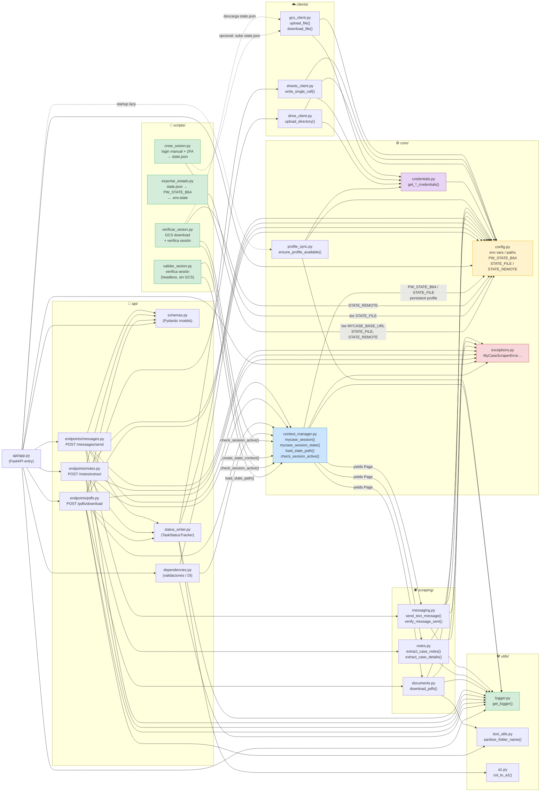
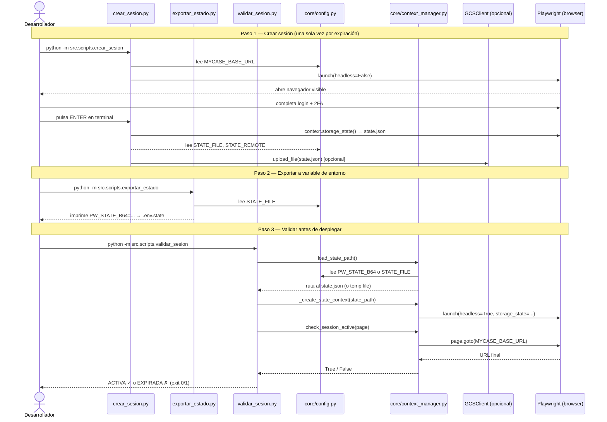
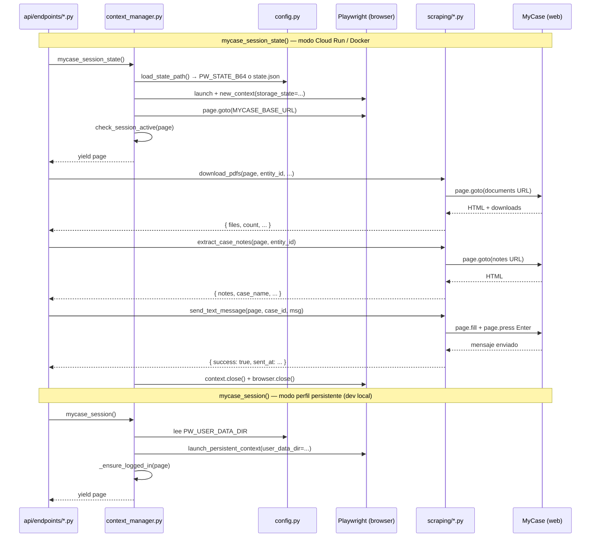
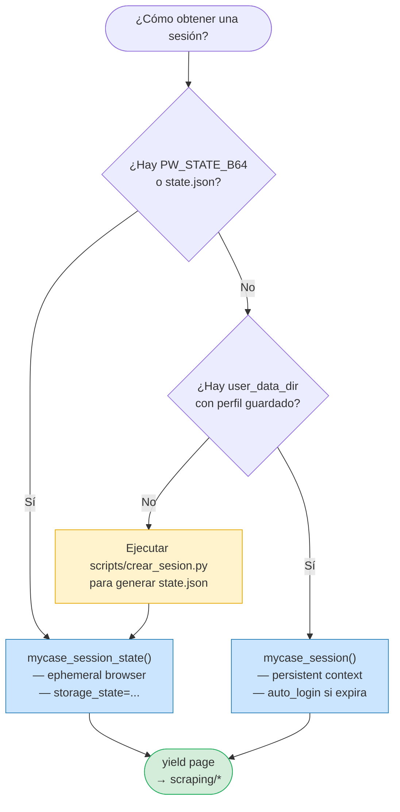

# Diagramas de Arquitectura

---

## Arquitectura general

```mermaid
graph LR
    %% ─── ENTRY POINT ───
    APP["api/app.py\n(FastAPI entry)"]

    %% ─── API LAYER ───
    subgraph API ["📡 api/"]
        SCHEMAS["schemas.py\n(Pydantic models)"]
        DEPS["dependencies.py\n(validaciones / DI)"]
        SW["status_writer.py\n(TaskStatusTracker)"]
        EP_PDF["endpoints/pdfs.py\nPOST /pdfs/download"]
        EP_NOTES["endpoints/notes.py\nPOST /notes/extract"]
        EP_MSG["endpoints/messages.py\nPOST /messages/send"]
    end

    %% ─── SCRIPTS (Session Management) ───
    subgraph SCRIPTS ["🔑 scripts/"]
        SC_CREAR["crear_sesion.py\nlogin manual + 2FA\n→ state.json"]
        SC_EXPORT["exportar_estado.py\nstate.json → PW_STATE_B64\n→ .env.state"]
        SC_VALID["validar_sesion.py\nverifica sesión\n(headless, sin GCS)"]
        SC_VERIF["verificar_sesion.py\nGCS download\n+ verifica sesión"]
    end

    %% ─── CORE ───
    subgraph CORE ["⚙️  core/"]
        CFG["config.py\nenv vars / paths\nPW_STATE_B64\nSTATE_FILE / STATE_REMOTE"]
        CTX["context_manager.py\nmycase_session()\nmycase_session_state()\nload_state_path()\ncheck_session_active()"]
        CREDS["credentials.py\nget_*_credentials()"]
        EXC["exceptions.py\nMyCaseScraperError…"]
        PSYNC["profile_sync.py\nensure_profile_available()"]
    end

    %% ─── SCRAPING ───
    subgraph SCRAPING ["🕷️  scraping/"]
        S_DOCS["documents.py\ndownload_pdfs()"]
        S_NOTES["notes.py\nextract_case_notes()\nextract_case_details()"]
        S_MSG["messaging.py\nsend_text_message()\nverify_message_sent()"]
    end

    %% ─── CLIENTS ───
    subgraph CLIENTS ["☁️  clients/"]
        C_DRIVE["drive_client.py\nupload_directory()"]
        C_SHEETS["sheets_client.py\nwrite_single_cell()"]
        C_GCS["gcs_client.py\nupload_file()\ndownload_file()"]
    end

    %% ─── UTILS ───
    subgraph UTILS ["🛠️  utils/"]
        LOG["logger.py\nget_logger()"]
        TXT["text_utils.py\nsanitize_folder_name()"]
        A1["a1.py\ncol_to_a1()"]
    end

    %% ══════════════════════════════
    %%  SCRIPTS → CORE
    %% ══════════════════════════════

    SC_CREAR -->|"lee MYCASE_BASE_URL\nSTATE_FILE, STATE_REMOTE"| CFG
    SC_CREAR -.->|"opcional: sube state.json"| C_GCS

    SC_EXPORT -->|"lee STATE_FILE"| CFG

    SC_VALID -->|"load_state_path()"| CTX
    SC_VALID -->|"check_session_active()"| CTX

    SC_VERIF -->|"_create_state_context()"| CTX
    SC_VERIF -->|"check_session_active()"| CTX
    SC_VERIF -->|"STATE_REMOTE"| CFG
    SC_VERIF -.->|"descarga state.json"| C_GCS

    %% ══════════════════════════════
    %%  CORE → SCRAPING
    %% ══════════════════════════════

    CTX -->|"PW_STATE_B64 / STATE_FILE\npersistent profile"| CFG
    CTX --> EXC
    CTX --> LOG
    CTX -->|"yields Page"| S_DOCS
    CTX -->|"yields Page"| S_NOTES
    CTX -->|"yields Page"| S_MSG

    %% ══════════════════════════════
    %%  API LAYER
    %% ══════════════════════════════

    APP --> SCHEMAS
    APP --> EP_PDF & EP_NOTES & EP_MSG
    APP --> DEPS
    APP --> CFG
    APP --> EXC
    APP --> LOG
    APP -.->|"startup lazy"| PSYNC

    DEPS --> CFG
    DEPS --> CTX
    DEPS --> LOG

    EP_PDF --> SCHEMAS & SW & CTX & CFG & EXC & S_DOCS & C_DRIVE & TXT & LOG
    EP_NOTES --> SCHEMAS & SW & CTX & CFG & EXC & S_NOTES & LOG
    EP_MSG --> SCHEMAS & SW & CTX & EXC & S_MSG & LOG

    SW --> C_SHEETS & A1 & CFG & LOG

    %% ══════════════════════════════
    %%  SCRAPING → UTILS/CONFIG
    %% ══════════════════════════════

    S_DOCS --> CFG & EXC & LOG & TXT
    S_NOTES --> CFG & EXC & LOG
    S_MSG --> CFG & EXC & LOG

    %% ══════════════════════════════
    %%  PROFILE SYNC / CREDENTIALS
    %% ══════════════════════════════

    PSYNC --> CFG & CREDS & LOG
    CREDS --> CFG

    %% ══════════════════════════════
    %%  CLIENTS
    %% ══════════════════════════════

    C_DRIVE --> CREDS & CFG
    C_SHEETS --> CREDS & CFG
    C_GCS --> CREDS & CFG

    %% ══════════════════════════════
    %%  ESTILOS
    %% ══════════════════════════════
    style CFG    fill:#fff3cd,stroke:#e6a800
    style EXC    fill:#f8d7da,stroke:#c0392b
    style LOG    fill:#d4edda,stroke:#27ae60
    style CTX    fill:#cce5ff,stroke:#2980b9
    style CREDS  fill:#e8d5f5,stroke:#8e44ad
    style SC_CREAR  fill:#d4edda,stroke:#27ae60
    style SC_EXPORT fill:#d4edda,stroke:#27ae60
    style SC_VALID  fill:#d4edda,stroke:#27ae60
    style SC_VERIF  fill:#d4edda,stroke:#27ae60
```

---

## Flujo de sesión (scripts)

```mermaid
sequenceDiagram
    actor Dev as Desarrollador
    participant CS  as crear_sesion.py
    participant EE  as exportar_estado.py
    participant VS  as validar_sesion.py
    participant CFG as core/config.py
    participant CTX as core/context_manager.py
    participant GCS as GCSClient (opcional)
    participant PW  as Playwright (browser)

    Note over Dev,PW: Paso 1 — Crear sesión (una sola vez por expiración)

    Dev->>CS: python -m src.scripts.crear_sesion
    CS->>CFG: lee MYCASE_BASE_URL
    CS->>PW: launch(headless=False)
    PW-->>Dev: abre navegador visible
    Dev->>PW: completa login + 2FA
    Dev->>CS: pulsa ENTER en terminal
    CS->>PW: context.storage_state() → state.json
    CS-->>CFG: lee STATE_FILE, STATE_REMOTE
    CS->>GCS: upload_file(state.json) [opcional]

    Note over Dev,PW: Paso 2 — Exportar a variable de entorno

    Dev->>EE: python -m src.scripts.exportar_estado
    EE->>CFG: lee STATE_FILE
    EE-->>Dev: imprime PW_STATE_B64=... → .env.state

    Note over Dev,PW: Paso 3 — Validar antes de desplegar

    Dev->>VS: python -m src.scripts.validar_sesion
    VS->>CTX: load_state_path()
    CTX->>CFG: lee PW_STATE_B64 o STATE_FILE
    CTX-->>VS: ruta al state.json (o temp file)
    VS->>CTX: _create_state_context(state_path)
    CTX->>PW: launch(headless=True, storage_state=...)
    VS->>CTX: check_session_active(page)
    CTX->>PW: page.goto(MYCASE_BASE_URL)
    PW-->>CTX: URL final
    CTX-->>VS: True / False
    VS-->>Dev: ACTIVA ✓  o  EXPIRADA ✗ (exit 0/1)
```

---

## Flujo de scraping (runtime)

```mermaid
sequenceDiagram
    participant API  as api/endpoints/*.py
    participant CTX  as context_manager.py
    participant CFG  as config.py
    participant PW   as Playwright (browser)
    participant SC   as scraping/*.py
    participant EXT  as MyCase (web)

    Note over API,EXT: mycase_session_state() — modo Cloud Run / Docker

    API->>CTX: mycase_session_state()
    CTX->>CFG: load_state_path() → PW_STATE_B64 o state.json
    CTX->>PW: launch + new_context(storage_state=...)
    CTX->>PW: page.goto(MYCASE_BASE_URL)
    CTX->>CTX: check_session_active(page)
    CTX-->>API: yield page

    API->>SC: download_pdfs(page, entity_id, ...)
    SC->>EXT: page.goto(documents URL)
    EXT-->>SC: HTML + downloads
    SC-->>API: { files, count, ... }

    API->>SC: extract_case_notes(page, entity_id)
    SC->>EXT: page.goto(notes URL)
    EXT-->>SC: HTML
    SC-->>API: { notes, case_name, ... }

    API->>SC: send_text_message(page, case_id, msg)
    SC->>EXT: page.fill + page.press Enter
    EXT-->>SC: mensaje enviado
    SC-->>API: { success: true, sent_at: ... }

    CTX->>PW: context.close() + browser.close()

    Note over API,EXT: mycase_session() — modo perfil persistente (dev local)

    API->>CTX: mycase_session()
    CTX->>CFG: lee PW_USER_DATA_DIR
    CTX->>PW: launch_persistent_context(user_data_dir=...)
    CTX->>CTX: _ensure_logged_in(page)
    CTX-->>API: yield page
```

---

## Modos de autenticación en context_manager

```mermaid
graph TD
    START(["¿Cómo obtener una sesión?"])

    START --> A{"¿Hay PW_STATE_B64\no state.json?"}

    A -->|Sí| B["mycase_session_state()\n— ephemeral browser\n— storage_state=..."]
    A -->|No| C{"¿Hay user_data_dir\ncon perfil guardado?"}

    C -->|Sí| D["mycase_session()\n— persistent context\n— auto_login si expira"]
    C -->|No| E["Ejecutar scripts/crear_sesion.py\npara generar state.json"]

    E --> B

    B --> F(["yield page\n→ scraping/*"])
    D --> F

    style B fill:#cce5ff,stroke:#2980b9
    style D fill:#cce5ff,stroke:#2980b9
    style E fill:#fff3cd,stroke:#e6a800
    style F fill:#d4edda,stroke:#27ae60
```
